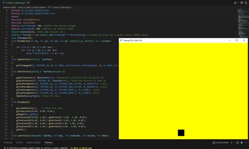

# How to write a pixel engine
## What you will need

#### The GCC compiler, for windows, Mac or Linux.
I use msys64 mingw64 for windows 10, and recommend it if you don't want to use visual studio.

#### The glfw library
To access opengl with keyboard options I use glfw3 library
 https://www.glfw.org/

#### The portaudio library (optional)
For adding sound to my projects I use the portaudio library
http://portaudio.com/

----
## This is not a tutorial

These examples and notes are not meant to be a tutorial, they are more of a guide on how to create your own pixel engine using c++\
especially if you want to create 2d retro games. If you like the arcade and computer games from the 1970's,1980's and early 1990's then you might
find these programs useful.

## Make a window

The first example:
```make_a_window.cpp```
demonstrates how to create a window using glfw.

The three main functions (other than the main() function) are as follows:
* controls() : handles pressing the escape-key to end the program.
* *init_window() : initializes the window, sets the size and title and sets the callback keys (escape key in this case).
* display() : swaps buffers and polls events.
See the documentation for GLFW for a clearer understanding of it's features\
https://www.glfw.org/docs/latest/intro_guide.html

## Get a framecount

Example two: 
```get_a_framecount.cpp```

Example of how to get the framerate for your program, note that ```glfwSwapInterval(0)``` changes the 60fps default, try commenting it out to see what it does.

There one other function change to note:

* display() : logic added to calculate the fps and display it on the windows title.

## Time for OpenGL

Example three: 
```time_for_open_gl.cpp```

using OpenGL with the glfw window. The first thing to do is fill the screen with a single quad. This will be the template of how the\
pixel engine will work going forward.

These are the function changes to look out for here:
* drawquad() : standard opengl (1.2,2.1) to create a quad. This is quite an old method (feel free to update as you please)
* *init_window() : Sampling set for antialiasing (optional)
* display() : setup the opengl viewport add adding the quad drawing to the main event loop.

It is still possible to reference the opengl 2.1 documentation at the current time link here:\
https://registry.khronos.org/OpenGL-Refpages/gl2.1/

## Texture that Quad

Example four:
```texture_that_quad.cpp```

A texture array gets drawn every cycle onto the quad, thjs is the basis of the pixel engine. The texture array is the dynamic content for the quad that fills the window.\
this will be the *screen array in the example.

New functions and changes to note are :
* UpdateTex() : load the array to the texture
* GenTexture() : generate a texture for the quad
* drawquad() : Add texture coodinates to the quad
* initwindow() : enable and generate the texture using the array

## Move a block

Example five:
```move_a_block.cpp```

This is the last example, put simply it moves a block around the display.
What is actually happening is a quad is drawn to the view area, and a texture is dynamically changed to create the illusion of animation.



## Next Steps

These examples are only meant to highlight a method of putting a pixel on a screen window. There's a lot of things that can be done using this method to draw to the screen.

These are a few of the things that I have done using a variation of this technique.

* Created a class 'wrapper' based on this process.
* Created a struct to hold screen array pointer and information about the screen.
* Created a putpixel function to change the color in the array.
* Wrote functions to wipe the texture quickly, draw lines, blocks, boxes, circles triangles etc.
* Wrote a font handler.
* Created a sprite handler.
* Added 2d matrix functions.
* Added alpha enabled quads for texture layers.
* Intergrated sound (portaudio).
* Left room for growth and change.

### Roadmap changes

* use a more recent version of OpenGL.
* integrate shaders.

### useful reading

https://open.gl/textures
